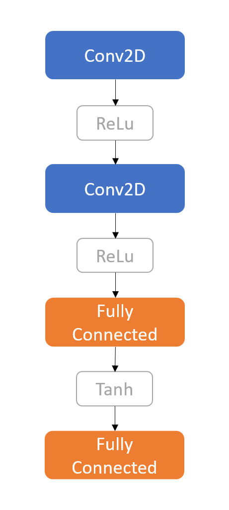

# Extension - Real AI

## Goal

The goal of this extension is to train a real deep-learning-based bot player.

## Design

### Neural Network Structure

The structure is very similar to LeNet-5. It takes in a 4-D tensor with the size of (`BATCH_SIZE`, 3, 3, 3). The other 2 channels are the previous piece map and the second previous piece map. The network outputs a distribution of probabilities indicating the scores of the 9 plaids plus a probability of afk, 10 elements in total.

### Training

`tictactoe.real_ai.boards.Boards` allows boards to be packed in batches. The model plays `BATCH_SIZE` games in parallel. Each game starts with the opponent going first, which is a `tictactoe.framework.RandomPlayer`. Every time the model gives an output, the loss is calculated using the Cross-Entropy method, comparing the output and `tictactoe.Bot`'s suggestion. The role of the rigid bot is very similar to a teacher in the distilling process. Then, instead of the model's output, the teacher's suggestion will be adopted to make the move.

Because the duration of every game is not constant, a hyperparameter `ROUND_LIMIT` is set to limit the number of rounds of each epoch. The boards are reset once they reach the `ROUND_LIMIT`. If a game ends before it reaches the limit, the teacher will give a suggestion for afk.

Calculated with simple math, it is not hard to realize that there are 9! which is 362880 different combinations for a board with the size of 3x3. Any `NUM_BATCHES` times `BATCH_SIZE` over 362880 should be sufficient.

In this particular experiment, the model only plays as the second player. When it plays as the first, the piece indexes on the board are inverted, meaning that 0 becomes 1 and 1 becomes 0. This makes a little sense to some extent, yet it is pretty much clear that it makes the model weaker when it plays as the first player.

One thing worth noticing while training is that the model is very sensitive to the choice of `ROUND_LIMIT`. A high `ROUND_LIMIT` can lead to excessive cases where the teacher teaches the model to afk and causes over-fitting, making the model surrender (referred to as afk above) prematurely. In this case, another hyperparameter `ZERO_LIMIT` is introduced. Any harmful game after the limit is reached will be invalidated.

In the experiment, it seems that the higher the `ROUND_LIMIT` is the lower the `BATCH_SIZE` should be and `ROUND_LIMIT` should be less than 9.
$$
BS \le 8 \cdot 2^{9-RL}
$$

## Testing

A variety of versions are trained with different hyperparameters. When testing the performance, they commonly show weakness in making appropriate decisions. Many of them even output invalid indexes or surrender prematurely.

## Limitations

Instead of training with reinforcement learning, it is somehow distilled from `tictactoe.Bot`. Due to the sketchy design, it does not show a state-of-art performance.

## Prospect

Reinforcement learning is very worth trying, yet it requires more effort to establish the loss function, so it is not included in this experiment as I have limited time to do the assignment.