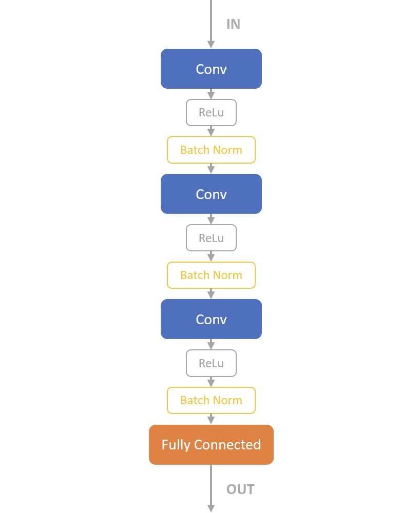

# Extension - Real AI

## Abstract

In this assignment, I proposed a convolutional neural network that has the ability to play Tic-Tac-Toe. It takes a 4-D tensor as input and outputs a distribution of probabilities. Harmful data nullification and transfer learning are used in training. Overall, the model exhibits moderate performance.

## Design

### Neural Network Structure



The structure is very similar to my previous work [*A Deep Learning Model for Accurate and Robust Internet Traffic Classification*](https://github.com/ProjectNeura/A-Deep-Learning-Model-for-Accurate-and-Robust-Internet-Traffic-Classification). It takes in a 4-D tensor with the size of (`BATCH_SIZE`, 3, 3, 3). The other 2 channels are the previous piece map and the second previous piece map. The network outputs a distribution of probabilities indicating the scores of the 9 plaids plus a probability of afk, 10 elements in total.

### Training

`tictactoe.real_ai.boards.Boards` allows boards to be packed in batches. The model plays `BATCH_SIZE` games in parallel. Each game starts with the opponent going first, which is a `tictactoe.framework.RandomPlayer`. Every time the model gives an output, the loss is calculated using the Cross-Entropy method, comparing the output and `tictactoe.Bot`'s suggestion. The role of the rigid bot is very similar to a teacher in the distilling process. Then, instead of the model's output, the teacher's suggestion will be adopted to make the move.

Because the duration of every game is not constant, a hyperparameter `ROUND_LIMIT` is set to limit the number of rounds of each epoch. The boards are reset once they reach the `ROUND_LIMIT`. If a game ends before it reaches the limit, the teacher will give a suggestion for afk.

Calculated with simple math, it is not hard to realize that there are 9! which is 362880 different combinations for a board with the size of 3x3. Any `NUM_BATCHES` times `BATCH_SIZE` over 362880 should be sufficient.

In this particular experiment, the model only plays as the second player. When it plays as the first, the piece indexes on the board are inverted, meaning that 0 becomes 1 and 1 becomes 0. This makes a little sense to some extent, yet it is pretty much clear that it makes the model weaker when it plays as the first player.

One thing worth noticing while training is that the model is very sensitive to the choice of `ROUND_LIMIT`. A high `ROUND_LIMIT` can lead to excessive cases where the teacher teaches the model to afk and causes over-fitting, prematurely making the model surrender (referred to as afk above). In this case, another hyperparameter `ZERO_LIMIT` is introduced. Any harmful game after the limit is reached will be invalidated.

In the experiment, it seems that the higher the `ROUND_LIMIT` is the lower the `BATCH_SIZE` should be and `ROUND_LIMIT` should be less than 9.
$$
BS \le 8 \cdot 2^{9-RL}
$$

#### Specs of Trained Models

| Model | NUM_BATCHES | BATCH_SIZE | ROUND_LIMIT | ZERO_LIMIT |
| ----- | ----------- | ---------- | ----------- | ---------- |
| 23m01 | 4000        | 32         | 7           | 0.1%       |
| 23m02 | 4000        | 32         | 7           | 0          |
| 23m03 | 4000        | 32         | 8           | 0          |
| 23m04 | 4000        | 32         | 6           | 0          |
| 23m05 | 4000        | 32         | 5           | 0          |
| 23m06 | 4000        | 32         | 4           | 0          |
| 23m07 | 4000        | 32         | 3           | 0          |
| 23m08 | 8000        | 32         | 6           | 0          |
| 23m09 | 8000        | 32         | 7           | 0          |
| 23m10 | 8000        | 32         | 8           | 0          |
| 23m11 | 8000        | 32         | 4           | 0          |
| 23m12 | 8000        | 32         | 5           | 0          |
| 23m13 | 40000       | 32         | 6           | 0          |
| 23m14 | 40000       | 32         | 4           | 0          |
| 23m15 | 40000       | 32         | 7           | 0          |
| 23m16 | 40000       | 16         | 6           | 0          |
| 23m17 | 40000       | 16         | 4           | 0          |
| 23m18 | 8000        | 16         | 6           | 0          |

## Testing

### Evaluation

A variety of versions are trained with different hyperparameters. When testing the performance, they commonly show weakness in making appropriate decisions. Some of them even output invalid indexes or surrender prematurely.

Each model is tested for 10k games against a `tictactoe.framework.RandomPlayer`. As there are random factors, the result might be slightly different every time.

**WP** shows two probabilities which are the chance that the model wins and the chance the opponent wins respectively.

**CD** shows the distribution of different conditions as `{someone won} / {tied} / {someone surrendered}`.

#### Playing as The First Player

| Model | WP            | CD                |
| ----- | ------------- | ----------------- |
| 23m01 | 48.78% 26.68% | 7126 / 2454 / 420 |
| 23m02 | 34.82% 29.44% | 6314 / 3574 / 112 |
| 23m03 | 58.61% 22.79% | 7987 / 1860 / 153 |
| 23m04 | 45.99% 19.37% | 6531 / 3464 / 5   |
| 23m05 | 35.16% 31.94% | 6214 / 3290 / 496 |
| 23m06 | 38.38% 28.20% | 6658 / 3342 / 0   |
| 23m07 | 39.88% 24.38% | 6426 / 3574 / 0   |
| 23m08 | 36.57% 28.39% | 6487 / 3504 / 9   |
| 23m09 | 58.07% 13.95% | 7139 / 2798 / 63  |
| 23m10 | 44.30% 22.97% | 6569 / 3273 / 158 |
| 23m11 | 39.02% 28.03% | 6705 / 3295 / 0   |
| 23m12 | 37.47% 24.65% | 6208 / 3788 / 4   |
| 23m13 | 48.22% 17.23% | 6538 / 3455 / 7   |
| 23m14 | 60.13% 17.08% | 7721 / 2279 / 0   |
| 23m15 | 54.64% 20.42% | 7506 / 2494 / 0   |
| 23m16 | 47.79% 25.26% | 7305 / 2695 / 0   |
| 23m17 | 49.52% 25.56% | 7508 / 2492 / 0   |
| 23m18 | 41.41% 26.05% | 6738 / 3254 / 8   |

#### Playing as The Second Player

| Model | WP            | CD               |
| ----- | ------------- | ---------------- |
| 23m01 | 49.49% 26.96% | 7628 / 2355 / 17 |
| 23m02 | 54.59% 24.00% | 7859 / 2400 / 0  |
| 23m03 | 42.11% 28.72% | 7012 / 2917 / 71 |
| 23m04 | 58.14% 23.25% | 8139 / 1861 / 0  |
| 23m05 | 54.08% 25.98% | 7935 / 1994 / 71 |
| 23m06 | 58.84% 20.58% | 7942 / 2058 / 0  |
| 23m07 | 59.60% 21.22% | 8082 / 1918 / 0  |
| 23m08 | 63.86% 19.90% | 8366 / 1624 / 10 |
| 23m09 | 51.96% 24.58% | 7554 / 2446 / 0  |
| 23m10 | 48.34% 26.00% | 7430 / 2566 / 4  |
| 23m11 | 61.91% 21.35% | 8326 / 1674 / 0  |
| 23m12 | 50.92% 25.07% | 7599 / 2401 / 0  |
| 23m13 | 41.94% 29.34% | 7118 / 2872 / 10 |
| 23m14 | 53.59% 25.58% | 7917 / 2083 / 0  |
| 23m15 | 41.84% 30.46% | 7230 / 2770 / 0  |
| 23m16 | 50.85% 25.10% | 7595 / 2405 / 0  |
| 23m17 | 49.97% 27.77% | 7774 / 2226 / 0  |
| 23m18 | 59.42% 23.63% | 8283 / 1695 / 22 |

### Showcase

The model sees the board differently in the following way:

```
 --------- --------- ---------
|         |         |         |
|    0    |    1    |    2    |
|         |         |         |
 --------- --------- ---------
|         |         |         |
|    3    |    4    |    5    |
|         |         |         |
 --------- --------- ---------
|         |         |         |
|    6    |    7    |    8    |
|         |         |         |
 --------- --------- ---------
```

#### Playing as The First

##### Case A

Model: `23m14`

```shell
AI output: 8.
 --------- --------- ---------
|         |         |         |
|         |         |         |
|         |         |         |
 --------- --------- ---------
|         |         |         |
|         |         |         |
|         |         |         |
 --------- --------- ---------
|         |         |         |
|         |         |    X    |
|         |         |         |
 --------- --------- ---------
```

```shell
AI output: 4.
 --------- --------- ---------
|         |         |         |
|    O    |         |         |
|         |         |         |
 --------- --------- ---------
|         |         |         |
|         |    X    |         |
|         |         |         |
 --------- --------- ---------
|         |         |         |
|         |         |    X    |
|         |         |         |
 --------- --------- ---------
```

```shell
AI output: 5.
 --------- --------- ---------
|         |         |         |
|    O    |         |    O    |
|         |         |         |
 --------- --------- ---------
|         |         |         |
|         |    X    |    X    |
|         |         |         |
 --------- --------- ---------
|         |         |         |
|         |         |    X    |
|         |         |         |
 --------- --------- ---------
```

```shell
AI output: 1.
 --------- --------- ---------
|         |         |         |
|    O    |    X    |    O    |
|         |         |         |
 --------- --------- ---------
|         |         |         |
|         |    X    |    X    |
|         |         |         |
 --------- --------- ---------
|         |         |         |
|         |    O    |    X    |
|         |         |         |
 --------- --------- ---------
```

Even though this is the best model for being the first player, the intention to defend is still so strong that it hardly has the ability to attack.

##### Case B

Model: `23m09`

```shell
AI output: 4.
 --------- --------- ---------
|         |         |         |
|         |         |         |
|         |         |         |
 --------- --------- ---------
|         |         |         |
|         |    X    |         |
|         |         |         |
 --------- --------- ---------
|         |         |         |
|         |         |         |
|         |         |         |
 --------- --------- ---------
```

```shell
AI output: 2.
 --------- --------- ---------
|         |         |         |
|    O    |         |    X    |
|         |         |         |
 --------- --------- ---------
|         |         |         |
|         |    X    |         |
|         |         |         |
 --------- --------- ---------
|         |         |         |
|         |         |         |
|         |         |         |
 --------- --------- ---------
```

```shell
AI output: 6.
 --------- --------- ---------
|         |         |         |
|    O    |    O    |    X    |
|         |         |         |
 --------- --------- ---------
|         |         |         |
|         |    X    |         |
|         |         |         |
 --------- --------- ---------
|         |         |         |
|    X    |         |         |
|         |         |         |
 --------- --------- ---------
```

Quite strange that the lower-ranking model actually plays better than the one above.

#### Playing as The Second

##### Case A

Model: `23m08`

```shell
AI output: 0.
 --------- --------- ---------
|         |         |         |
|    O    |         |         |
|         |         |         |
 --------- --------- ---------
|         |         |         |
|    X    |         |         |
|         |         |         |
 --------- --------- ---------
|         |         |         |
|         |         |         |
|         |         |         |
 --------- --------- ---------
```

```shell
AI output: 2.
 --------- --------- ---------
|         |         |         |
|    O    |    X    |    O    |
|         |         |         |
 --------- --------- ---------
|         |         |         |
|    X    |         |         |
|         |         |         |
 --------- --------- ---------
|         |         |         |
|         |         |         |
|         |         |         |
 --------- --------- ---------
```

```shell
AI output: 4.
 --------- --------- ---------
|         |         |         |
|    O    |    X    |    O    |
|         |         |         |
 --------- --------- ---------
|         |         |         |
|    X    |    O    |    X    |
|         |         |         |
 --------- --------- ---------
|         |         |         |
|         |         |         |
|         |         |         |
 --------- --------- ---------
```

```shell
AI output: 8.
 --------- --------- ---------
|         |         |         |
|    O    |    X    |    O    |
|         |         |         |
 --------- --------- ---------
|         |         |         |
|    X    |    O    |    X    |
|         |         |         |
 --------- --------- ---------
|         |         |         |
|    X    |         |    O    |
|         |         |         |
 --------- --------- ---------

AI B won!
```

## Ablation Experiment

### Piece Invert

Since this method is only enabled when the model plays as the first player, comparing the evaluation results when it is enabled and disabled is an intuitive way to determine the effectiveness of this method.

| Model | WP (Piece Invert Enabled) | WP (Piece Invert Disabled) |
| ----- | ------------------------- | -------------------------- |
| 23m02 | 34.82% 29.44%             | 34.79% 30.06%              |
| 23m14 | 60.13% 17.08%             | 58.49% 18.44%              |

From the table, it is clear that this method does improve the model's ability, albeit by a small margin.

## Conclusion and Limitations

In conclusion, the model is able to play the game, yet not as robust as `tictactoe.Bot` is. However, it can be an advantage that the model actually shows more human characteristics.

Instead of training with reinforcement learning, it is somehow distilled from `tictactoe.Bot`. Due to the sketchy design, it does not show a state-of-art performance.

## Prospect

Reinforcement learning is very worth trying, yet it requires more effort to establish the loss function, so it is not included in this experiment as I have limited time to do the assignment.